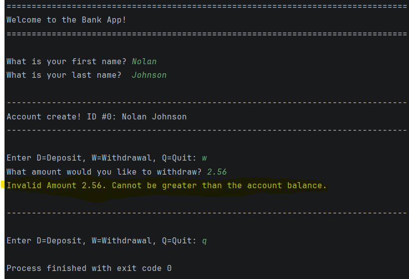
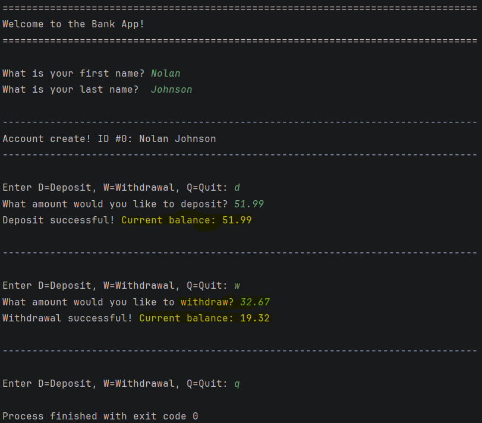

# BankApp

## 📌 Description

This is a simple **Bank Account application** written in Java.
When the app runs, the user can view a menu and choose to check their balance, deposit money, withdraw money, or exit.

---

## 🎯 Objectives

The objectives of this assignment were to:

- Practice object-oriented programming using Java
- Create and use custom classes (such as Bank or Account)
- Implement a menu-driven console application
- Use loops and conditional statements for program control
- Handle user input using the `Scanner` class
- Perform basic arithmetic operations for deposits and withdrawals

---

## 🧾 How to Run

###  Clone the Repository

```bash
git clone https://github.com/nojohn04/JavaSection2_BankApp.git
```

---

## 🛠 Features

- Displays a simple menu for user interaction
- Allows depositing and withdrawing money
- Shows the current account balance
- Continues running until the user selects **Exit**

---

## 📸 Sample Output
___
### **Withdrawing Without Depositing**


### **Depositing and Withdrawing**

---

## 👥 Authors
- [@nojohn04](https://github.com/nojohn04) Nolan Johnson
- [@qschroetlin](https://github.com/qschroetlin) Quinn Schroetlin

